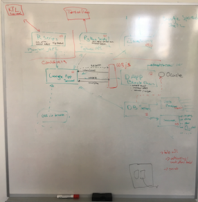

```{r include=FALSE}
library(knitr)
library(leaflet)
library(tidyverse)
```

## Our Journey 

```{r echo=FALSE, fig.height=10, fig.width=10, message=FALSE, warning=FALSE}
rpandaIcon <- makeIcon(
  iconUrl = "iconRP.png",
  iconWidth = 50, iconHeight = 50,
)

nimaIcon <- makeIcon(
  iconUrl = "Nima.png",
  iconWidth = 50, iconHeight = 50,
)

philIcon <- makeIcon(
  iconUrl = "Phil.png",
  iconWidth = 50, iconHeight = 50,
)

template<-"<b>Current:</b> {currentjob} </br> Former: {former} </br> in: <a href={linkedin}>Linkedin Profile</a>"

nimaProfile<- glue::glue(template,currentjob="Head of Market Analytics - Cenovus",former="Scotiabank and BP",linkedin="https://www.linkedin.com/in/nimasafaian/")

philProfile<- glue::glue(template,currentjob="Sorensen Exec Prof UofA",former="Cenovus, Scotiabank, BP, Bank of Canada",linkedin="https://www.linkedin.com/in/philippe-cote-88b1769/")

rpandaProfile<-"<b>rpanda training solutions</b></br>Calgary Based - BC Registered Company
</br>Education Technology</br>Web:<a href=http://rpanda.co>rpanda.co</a>"


load("map.RData")
tanks<-tribble(~name,~lng,~lat,
        "STOR1",-96.751,35.953,
        "STOR2",-93.985,30.002,
        "STOR3",-95.313,28.959
        )
production<-tribble(~name,~lng,~lat,
                    "Production",-97.534,36.256)

leaflet() %>%
  addTiles() %>%
  setView(lng = -114,lat=51,zoom = 6) %>%
  leaflet::addLegend("topleft", 
                     colors = c("black","blue","green"),
                     labels = c("Storage","Production","Oil Pipe"), 
                     opacity = 0.8) %>%
addPolylines(data=crudepipes,color = "green",
             weight = 1,
             group="Complexity") %>%
  addCircleMarkers(data=refineries,color=~dplyr::case_when(Cokin_Mbpd>0~"black",TRUE~"brown")
                   ,radius =~AD_Mbpd/100,popup =~paste0(Corp,"-",Site),group = "Complexity") %>% 
  addCircleMarkers(data=tanks,color="black",radius =2,popup =~name,group = "Complexity") %>%
  addCircleMarkers(data=production,color="blue",radius =5,popup =~name,group = "Complexity") %>%
  addMarkers(lng=-114, lat=51,icon=rpandaIcon,popup = rpandaProfile,group="Who we are") %>%
  addMarkers(lng=-113, lat=52,icon=nimaIcon,popup = nimaProfile,group="Who we are") %>%
  addMarkers(lng=-115, lat=52,icon=philIcon,popup = philProfile,group="Who we are") %>%
  addLayersControl(baseGroups = c("Who we are","Complexity")) 
```

## Commodities Trading

* Complex supply chain with physical commodities.
+ Outages and/or Imbalances cause price dislocations $=$ opportunities.
+ Supply chain assets are real-options in multiple state-spaces:
  - Time 
  - Location 
  - Grade
+ Successful traders are experts at:
  - Understanding this optionality.
  + Monetizing it through acquiring access to high value assets.
  + Monetizing it through the financial and physical instruments.  

## RPanda idea in a nutshell

<div class="columns-2">

<div>
<span style="color:black; font-weight:bold">Problem</span> <br>
Trader Competencies Assessment and Development <br>
<br>
<span style="color:black; font-weight:bold">For Whom</span> <br>
Universities and Corporates in commodities space <br>
<br>
<span style="color:black; font-weight:bold">Unique Value Proposition</span> <br>
Leading industry experience in hiring, developing and leading traders, backed by quantitative skills <br>
<br>
<span style="color:black; font-weight:bold">Solution</span> <br>
- Multi day trader game <br>
- Real time trader game <br>
- Negotiation Game 
</div>
</div>

## Platform and App Design 

<div class="columns-2">

<div>

- **100% Open source Code: <br> `R`, `shiny`, `python`**
- **Open Source R Package helper** <br> https://github.com/risktoollib/RTL
- **Modular design using `Plumber API`**
- **Amazon AWS Scalable design**
- **Asset Plug-ins** with R Package.

</div>
</div>


## Real Time Simulation

<div align="center">
<iframe width="400" height="150" src="https://www.youtube.com/embed/_LGkbvkCS3I" frameborder="0" allowfullscreen></iframe>
</div>


## Scaling Challenges - Lesson Learned!

<div class="columns-2">

<div>

- **Scaling > 10 users was challenging**
- **Used `Profiler` and `shinycannon` to debug performance**
- **Removed Disk Read-Write Dependency**
- **`Plotly` over `ggplot` for faster rendering**
- **AWS API to Scale up/down nodes**
- **Cloud deployment wins in Enterprise Deployment**
</div>
</div>

## What's Next

- Universities user-base in the context of trading courses.
- Development of Global Virtual Inter-University competition.
- Incorporate NLP and Learning Algorithms to assess trader competencies.
- Current Advanced Discussions with leading Corporates.
  + Active presence in commodities trading.
  + Limited resources for in-house development.


 
